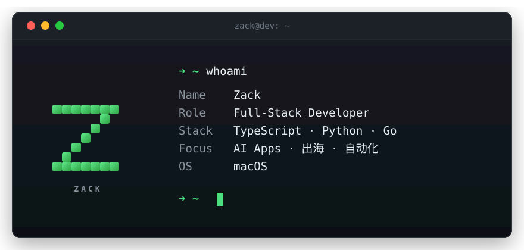

  

<h3 align="center">Full-Stack Developer · AI Apps · 出海 & 自动化</h3>

  
  
  

---

### 🛠 Tech Stack

  
  
  
  
  
  

---

### 📊 GitHub Stats

  <picture>
    <source media="(prefers-color-scheme: dark)" srcset="https://github-readme-stats.vercel.app/api?username=yckonnnnn&show_icons=true&hide_border=true&bg_color=00000000&theme=github_dark" />
    <source media="(prefers-color-scheme: light)" srcset="https://github-readme-stats.vercel.app/api?username=yckonnnnn&show_icons=true&hide_border=true&bg_color=00000000" />
    
  </picture>
  <picture>
    <source media="(prefers-color-scheme: dark)" srcset="https://streak-stats.demolab.com?user=yckonnnnn&hide_border=true&background=00000000&theme=github-dark-blue" />
    <source media="(prefers-color-scheme: light)" srcset="https://streak-stats.demolab.com?user=yckonnnnn&hide_border=true&background=00000000" />
    
  </picture>

---

### 🚀 Featured Projects

  
  
  

---

### 🐍 Contribution Snake

  <picture>
    <source media="(prefers-color-scheme: dark)" srcset="https://raw.githubusercontent.com/yckonnnnn/yckonnnnn/output/github-contribution-grid-snake-dark.svg" />
    <source media="(prefers-color-scheme: light)" srcset="https://raw.githubusercontent.com/yckonnnnn/yckonnnnn/output/github-contribution-grid-snake.svg" />
    
  </picture>

